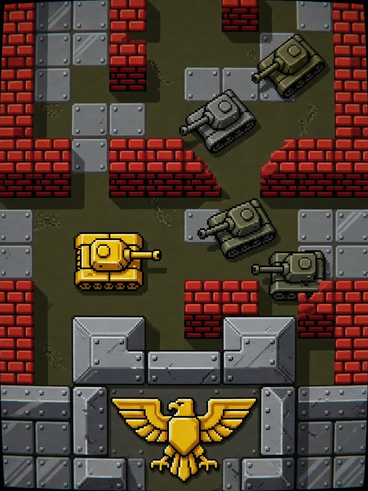

  <strong>简体中文</strong> · <a href="README.md">English</a>

# 🛡️ 经典坦克大战 1990 (Battle City 1990)

  🎮 FC 经典复刻 / 战术保卫
  ⚡ 本地单机 · 离线免 Wi-Fi
  🕹️ 3键掌机体验

### 📖 游戏简介

红白机童年经典完全复刻！保卫老鹰基地总部，巧妙利用砖墙与钢铁掩体，击溃不同护甲与速度的敌方坦克集群。

---

### 🎮 操作指南

| 按键 | 动作效果 |
| :--- | :--- |
| **UP (短按)** | 坦克顺时针改变行进方向并前进步进 |
| **DOWN (短按)** | 坦克逆时针改变行进方向并前进步进 |
| **OK (短按)** | 发射穿甲炮弹（摧毁砖块与敌方战车） |
| **OK (长按 1.5s)** | 退出并返回主菜单 |

---

### 📦 源码与运行方式

- **源码位置**：`main/demo_battlecity.c, main/battlecity_logic.c`
- **固件合集启动**：刷入当前仓库 [Alex Arcade 掌机固件](../../README.zh_CN.md) 后，在开机菜单中选择 **Battle City 1990** 即可进入。
- **返回游戏大厅**：点击返回 [🎮 游戏中心展厅目录](../../README.zh_CN.md)。
