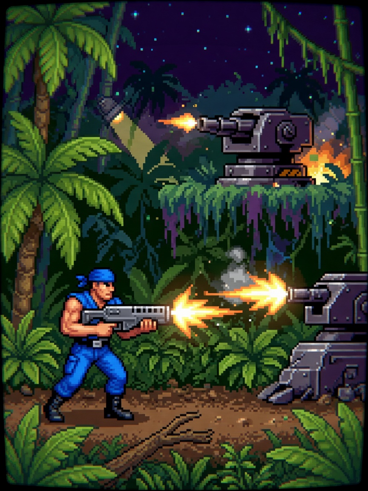

  <strong>简体中文</strong> · <a href="README.md">English</a>

# 🔫 魂斗罗 (Contra)

  🎮 动作射击 / 经典街机
  ⚡ 本地单机 · 离线免 Wi-Fi
  🕹️ 3键掌机体验

### 📖 游戏简介

经典的硬派丛林特种作战！迎击漫天袭来的敌军弹幕与机械炮台，拾取武器胶囊切换子弹，一路挺进消灭外星异形核心！

---

### 🎮 操作指南

| 按键 | 动作效果 |
| :--- | :--- |
| **UP (短按)** | 仰角瞄准 / 翻滚起跳 |
| **DOWN (短按)** | 战术趴下卧倒（闪避子弹） |
| **OK (短按)** | 连续开火射击 |
| **OK (长按 1.5s)** | 退出并返回主菜单 |

---

### 📦 源码与运行方式

- **源码位置**：`main/demo_contra.c, main/contra_logic.c`
- **固件合集启动**：刷入当前仓库 [Alex Arcade 掌机固件](../../README.zh_CN.md) 后，在开机菜单中选择 **Contra** 即可进入。
- **返回游戏大厅**：点击返回 [🎮 游戏中心展厅目录](../../README.zh_CN.md)。
