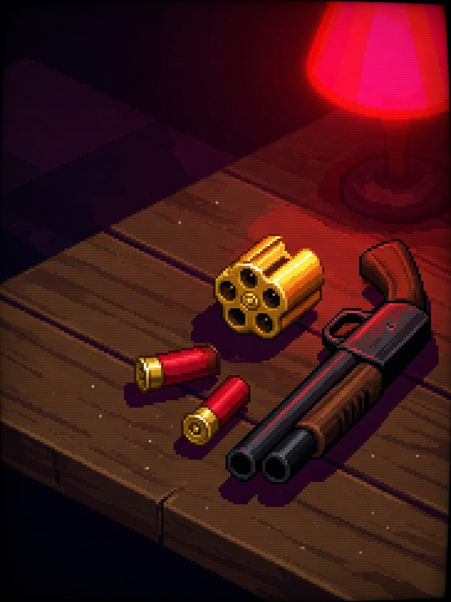

  <a href="README.zh_CN.md">简体中文</a> · <strong>English</strong>

# 🎰 Cyber Roulette

  🎮 Party Game / Decision Wheel
  ⚡ Offline · No Wi-Fi Needed
  🕹️ 3-Button Arcade

### 📖 Overview

The flashy cyberpunk decision wheel! Settle lunch picks, who pays the bill, or party dares with spinning neon lights!

---

### 🎮 Controls

| Button | In-Game Action |
| :--- | :--- |
| **OK (Short)** | Spin roulette wheel / trigger smooth braking |
| **OK (Long 1.5s)** | Exit and return to main launcher menu |

---

### 📦 Source & Flashing

- **Source Code**: `main/demo_roulette.c, main/roulette_logic.c`
- **Play via Arcade**: Flash the [Alex Arcade Full Firmware](../../README.md), then choose **Cyber Roulette** from the boot menu.
- **Game Hub**: Back to the [🎮 Arcade Game Hub](../../README.md).
