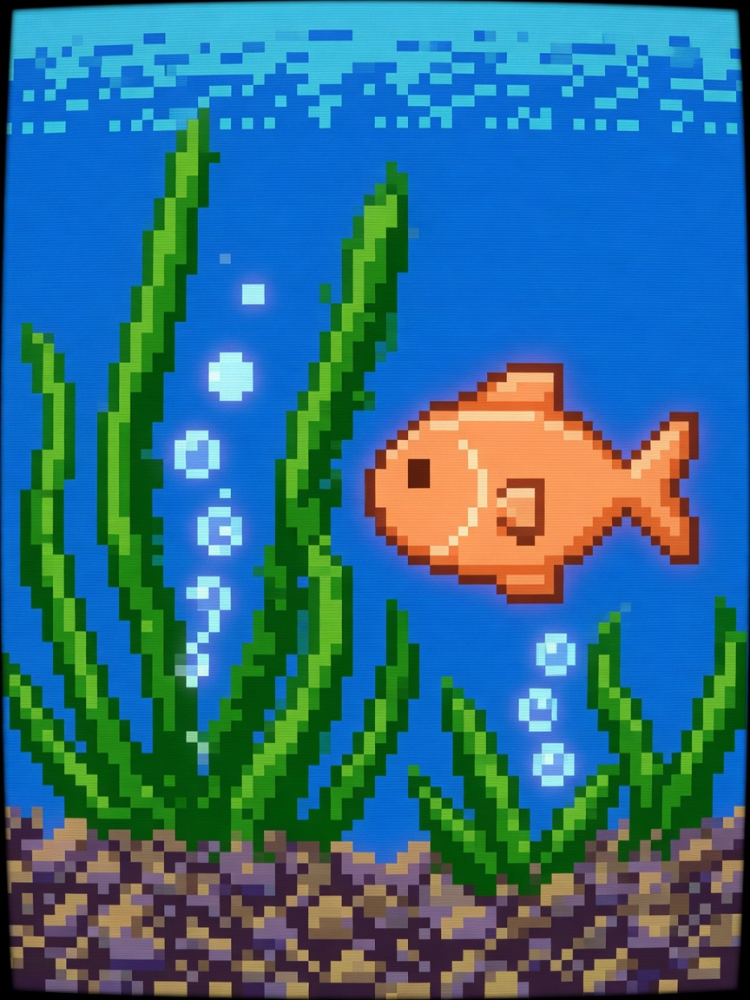

  <strong>简体中文</strong> · <a href="README.md">English</a>

# 🐟 大鱼吃小鱼 (Fish Hunter: Ocean Survival)

  🎮 海底吞噬 / 生存成长
  ⚡ 本地单机 · 离线免 Wi-Fi
  🕹️ 3键掌机体验

### 📖 游戏简介

充满生机的深海生态生存战！从小小幼鱼起步，捕食比自己更小的小虾小鱼成长进化，机敏躲避深海大白鲨！

---

### 🎮 操作指南

| 按键 | 动作效果 |
| :--- | :--- |
| **UP (短按)** | 向上游动浮升 |
| **DOWN (短按)** | 向下游动下潜 |
| **OK (短按)** | 冲刺突进捕食 |
| **OK (长按 1.5s)** | 退出并返回主菜单 |

---

### 📦 源码与运行方式

- **源码位置**：`main/demo_fish.c, main/fish_logic.c`
- **固件合集启动**：刷入当前仓库 [Alex Arcade 掌机固件](../../README.zh_CN.md) 后，在开机菜单中选择 **Fish Hunter: Ocean Survival** 即可进入。
- **返回游戏大厅**：点击返回 [🎮 游戏中心展厅目录](../../README.zh_CN.md)。
