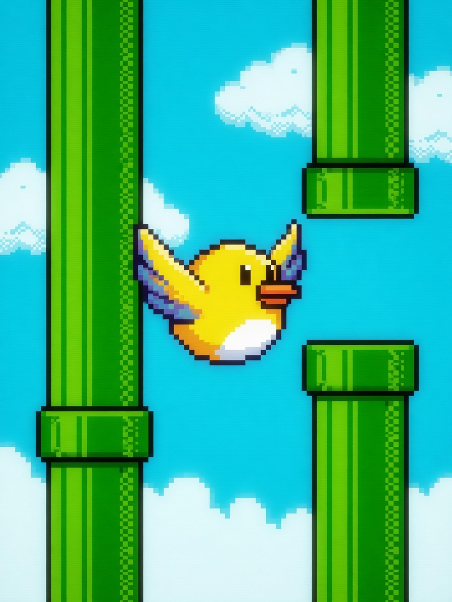

  <a href="README.zh_CN.md">简体中文</a> · <strong>English</strong>

# 🐦 Flappy Bird HD

  🎮 Precision Tap Arcade
  ⚡ Offline · No Wi-Fi Needed
  🕹️ 3-Button Arcade

### 📖 Overview

The legendary precision tap challenge! Rhythmically tap to flap wings, balance altitude, and navigate endless green pipes.

---

### 🎮 Controls

| Button | In-Game Action |
| :--- | :--- |
| **OK (Short)** | Flap wings upward |
| **OK (Long 1.5s)** | Exit and return to main launcher menu |

---

### 📦 Source & Flashing

- **Source Code**: `main/demo_flappy.c, main/flappy_logic.c`
- **Play via Arcade**: Flash the [Alex Arcade Full Firmware](../../README.md), then choose **Flappy Bird HD** from the boot menu.
- **Game Hub**: Back to the [🎮 Arcade Game Hub](../../README.md).
