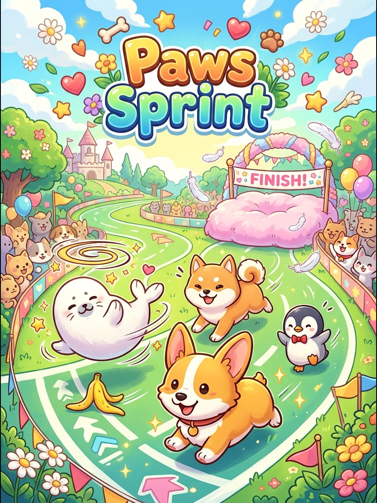

  <strong>简体中文</strong> · <a href="README.md">English</a>

# 🐶 短腿爪爪运动会 (Paws Sprint: Fluffy Runner)

  🎮 萌宠跑酷 / 竞速避障
  ⚡ 本地单机 · 离线免 Wi-Fi
  🕹️ 3键掌机体验

> 🚀 **网页一键在线刷入**：可在电脑 Chrome 浏览器打开 [官方社区落地页](https://ai-passport.folotoy.cn/play/community-3133e9da)，连上数据线点击「一键安装」秒玩！

### 📖 游戏简介

操控短腿柯基、软萌折耳猫或圆滚小法斗，在 3 条跑道上闪转腾挪、起跳越障、收集零食金币并体验旋转起步！色彩明快，节奏轻快解压，治愈力满分。

---

### 🎮 操作指南

| 按键 | 动作效果 |
| :--- | :--- |
| **UP (上键)** | 向上变道（精准对齐中线，不跑偏） |
| **DOWN (下键)** | 向下变道（精准对齐中线，不跑偏） |
| **OK (短按)** | 角色轻盈起跳，跃过跨栏与泥坑障碍 |
| **OK (长按 1.5s)** | 结束当前对局并安全返回主菜单 |

---

### 📦 源码与运行方式

- **源码位置**：`main/demo_pawssprint.c, main/pawssprint_logic.c`
- **固件合集启动**：刷入当前仓库 [Alex Arcade 掌机固件](../../README.zh_CN.md) 后，在开机菜单中选择 **Paws Sprint: Fluffy Runner** 即可进入。
- **返回游戏大厅**：点击返回 [🎮 游戏中心展厅目录](../../README.zh_CN.md)。
