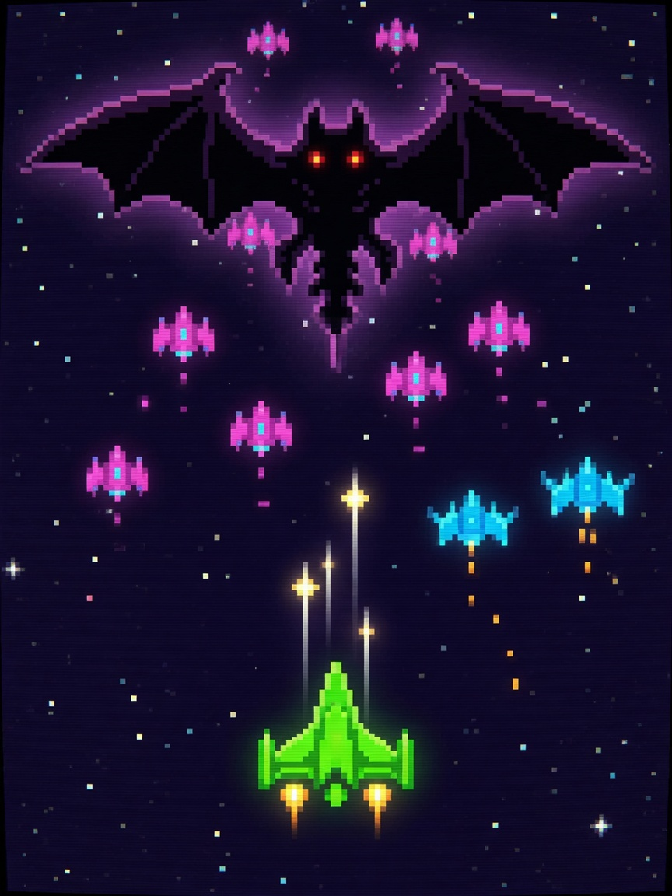

  <strong>简体中文</strong> · <a href="README.md">English</a>

# ✈️ 雷霆战机 (Thunder Striker)

  🎮 飞行射击 / 弹幕街机
  ⚡ 本地单机 · 离线免 Wi-Fi
  🕹️ 3键掌机体验

### 📖 游戏简介

经典街机弹幕飞行射击！驾驶高科技主力战机穿梭在敌方防空火力网中，不断升级主炮弹道，释放全屏超强毁灭波！

---

### 🎮 操作指南

| 按键 | 动作效果 |
| :--- | :--- |
| **UP (短按)** | 战机爬升并前压 |
| **DOWN (短按)** | 战机后撤规避 |
| **OK (短按)** | 爆发式主炮射击 / 双发重炮 |
| **OK (长按 1.5s)** | 退出并返回主菜单 |

---

### 📦 源码与运行方式

- **源码位置**：`main/demo_thunder.c, main/thunder_logic.c`
- **固件合集启动**：刷入当前仓库 [Alex Arcade 掌机固件](../../README.zh_CN.md) 后，在开机菜单中选择 **Thunder Striker** 即可进入。
- **返回游戏大厅**：点击返回 [🎮 游戏中心展厅目录](../../README.zh_CN.md)。
